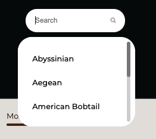
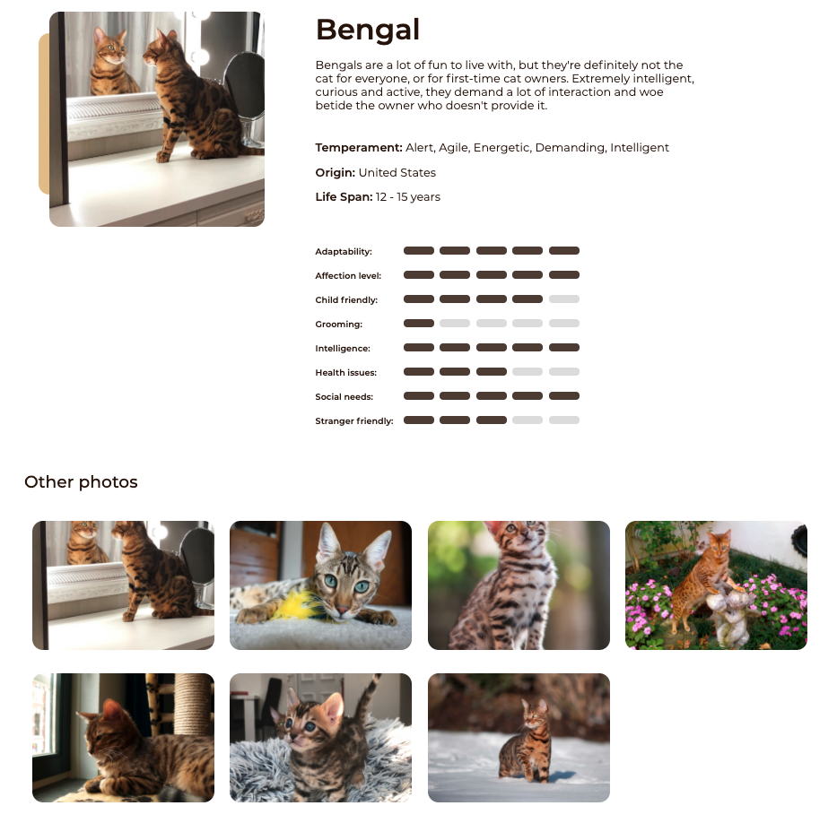
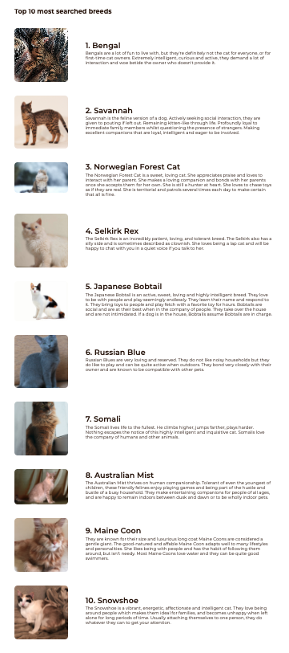
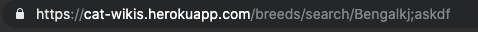

# CatWiki

This app was created as a solution entry for [DevChallenges](http://devchallenges.io/) using React for the frontend and Node and ExpressJS for the backend. 

## Challenge Prompt

- User story: I can search for cat breeds and select a breed of my choice
- User story: I can see the most popular searched cat breeds summary on the homepage
- User story: I can see the top 10 most searched cat breeds
- User story: I can see the breed details including description, temperament, origin, life span, adaptability, affection level, child friendly, grooming, intelligence, health issues, social needs, stranger friendly
- User story: I can see more photo of the breed
- User story: On mobile, when I select the search option, a modal for breed search should pop up
- User story (optional): I can go to an article about cats when I click read more on Why you should have a cat section
- User story (optional): I can go to the top 10 cats by clicking see more in the dashboard

## What does this project do?
This project functions as a pseudo-wikipedia for looking up information on different cat breeds.

1. Once the user enters the page, they will be prompted to select a cat breed by typing into the search bar (w/ filtered dropdown)

  

2. The user can then click on a cat breed or manually type the search entry to learn more information about them
  

3. The user can view a list of the Top 10 cat breeds and a brief snippet about them. 
  

## Other Small Features 

1. Query Error handling 

Bad queries or invalid URLs get handled and redirected to a 404 Not Found page

2. Loading Page 

While the data is being fetched from the server and transferred to the front-end, the user will be blocked from seeing the webpage and will instead see an animation. 
